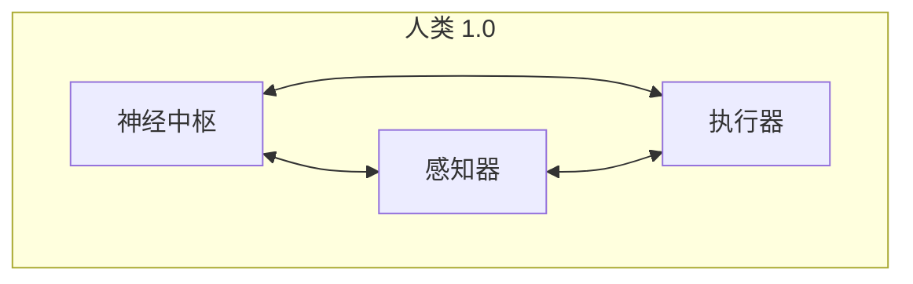

# 人类 3.0：开放式神经架构

> **本文档是“相空间拓展计划”中“认知增强”维度的核心技术构想，旨在通过架构升级，突破生物限制，为认知能力的无限扩展奠定基础。**

---

### 1.0 架构：生物一体化系统 (The Biological Monolith)

传统的人类（“人类 1.0”）是一个高度集成但封闭的系统。其神经中枢（大脑）与感知器（眼、耳）、执行器（四肢）和维持系统（内脏）物理绑定，无法分离、替换或独立扩展。

- **结构：** 一体化，硬件与软件强耦合。
- **接口：** 非标准化的生物接口，带宽低，延迟高。
- **进化：** 依赖于缓慢的生物演化。
- **系统性质：** 功能固定的封闭系统。

---

### 3.0 架构：开放式神经核心与模块化接口 (The Open Neural Core)

“人类 3.0”架构的核心思想是将**计算核心**与**功能模块**分离。通过标准化的神经接口，纯粹的计算与决策单元（神经核心）可以与任意可插拔的外部模块连接，形成一个开放、可扩展的智能网络。

- **神经核心 (Neural Core):**
  - **功能：** 仅负责高级认知功能，如信号处理、学习、决策与意识。
  - **特性：** 基于其物理结构上限，可不断扩展神经元数量与连接复杂度。

- **标准化接口 (Standardized Interface):**
  - **功能：** 实现神经核心与外部模块之间的高带宽、低延迟数据交换。
  - **特性：** 协议开放，支持即插即用。

- **外部模块 (External Modules):**
  - **感知模块:** 摄像头阵列、麦克风矩阵、光谱分析仪等。
  - **执行模块:** 机械臂、无人机群、微型机器人等。
  - **计算模块:** 服务器集群、量子计算机、其他神经核心等。
  - **数字模块:** 任意数字设备或虚拟系统。

这种架构的革命性在于，它将信息交互从间接的、有损的信号传递（语言、文字）转变为**直接的、无损的神经数据交换**。

> **交互范式转变：从“说出想法”到“直连思维”。**

---

### 2.0 架构对比分析 (Architectural Comparison)

| 维度 | 1.0 架构 (生物一体化) | 3.0 架构 (开放式核心) | 变革意义 |
| :--- | :--- | :--- | :--- |
| **结构** | 封闭、一体化 | 开放、模块化 | 从固定硬件到可升级平台 |
| **感知** | 受限于生物感官 | 可扩展至任意物理/数字传感器 | 感知边界的无限拓展 |
| **计算** | 个体大脑独立运算 | 集群协同与分布式学习 | 从单体智能到网络化超级智能 |
| **交互** | 语言、文字等低带宽中介 | 神经信号级高带宽直连 | 消除沟通损耗，实现思维同步 |
| **进化** | 达尔文式生物进化 (慢) | 技术迭代式升级 (快) | 进化速率的指数级提升 |
| **系统性质** | 孤立的封闭系统 | 可并入全球智能网的开放节点 | 个体成为全球意识网络的一部分 |

---

### 3.0 核心跃迁与意义 (Core Transition & Implications)

“人类 3.0”架构代表着从**生物有机体 (Biological Organism)**向**可进化的神经网络体 (Evolvable Neural Entity)**的根本性跃迁。

这种跃迁意味着：

1.  **认知能力的解耦与超载：** 思维不再受限于单一肉体的处理能力，可以与多个外部模块并行运行，实现超载。
2.  **学习与经验的共享化：** 技能和知识可以像数据一样在不同神经核心之间复制和迁移，实现即时学习。
3.  **存在的形态可塑性：** “身体”成为一个可按需配置的硬件集合，个体的存在形态不再固定。

最终，这种架构将彻底打破认知维度的稀缺性，使体验和创造不再受限于物理条件的约束，从而极大地扩展了文明的**相空间**。
