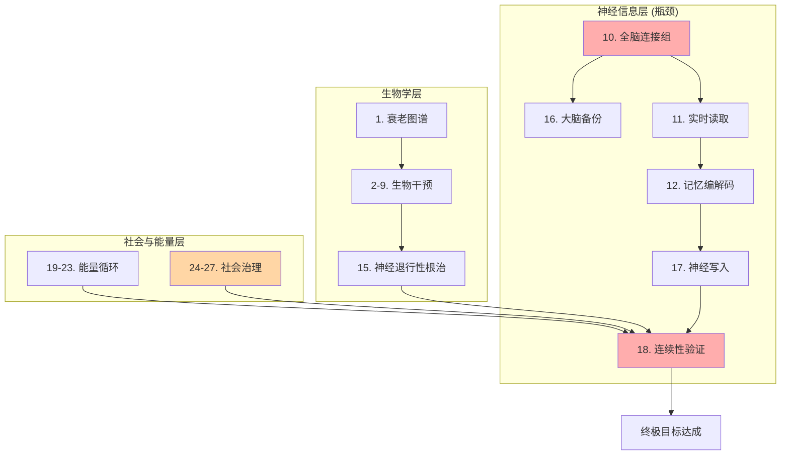

# 时间维度突破：27个关键要素清单

**版本**: 2.0
**更新日期**: 2025-11-18
**定位**: 本文档是“相空间拓展计划”中“时间延展”维度的核心技术分解清单，旨在通过系统性地集齐所有必要要素，以实现长寿逃逸速度（LEV）。

---

## 1. 核心理念与操作性定义

### 1.1 哲学基础
> "任何复杂目标的实现，本质上是其所有必要构成要素的集合。我们的任务就是识别、获取并整合这些要素。"

### 1.2 目标操作性定义
- **终极目标**: 实现意识在时间维度上的无限延续。
- **验收标准**:
  1. **主观连续性**: 个体的主观体验流不中断（“你”仍然是“你”）。
  2. **物理连续性**: 物理时间 `t → ∞` 时，承载意识的系统仍能维持功能。
  3. **可验证性**: 外部观察者能通过客观标准确认身份的延续。

---

## 2. 完全要素清单 (The 27 Elements)

### 第一部分：生物学基础 (9 要素)

#### 要素1：衰老机制完全图谱
- **状态**: 80%
- **描述**: 明确所有衰老标志（Hallmarks of Aging）及其相互间的因果关系。当前López-Otín (2023)版已有12项，但其优先级和网络关系尚不明确。
- **行动**: 建立多组学（基因组、表观、蛋白组、代谢组）统一数据库，进行大规模纵向研究。

#### 要素2：端粒维持技术
- **状态**: 60%
- **描述**: 安全、可控地维持端粒长度，而不增加癌症风险。
- **行动**: 开发可逆的端粒酶激活开关，并与高精度癌症监测系统结合。

#### 要素3：细胞衰老清除 (Senolytics)
- **状态**: 40%
- **描述**: 高效、特异性地清除体内衰老的“僵尸细胞”。
- **行动**: 开发靶向性更强的新一代Senolytics药物，并研究纳米递送系统。

#### 要素4：干细胞再生库
- **状态**: 50%
- **描述**: 建立个人专用的、可长期稳定储存并能精准分化的诱导多能干细胞（iPSC）库。
- **行动**: 建立个人iPSC银行标准流程，目标每10年更新一次细胞样本。

#### 要素5：器官再生与替换
- **状态**: 30%
- **描述**: 实现复杂器官（如心脏、肝脏、大脑）的体外培育与功能性移植。
- **行动**: 重点攻克器官的血管化网络自组装技术。

#### 要素6：DNA损伤修复强化
- **状态**: 20%
- **描述**: 实现对全基因组累积损伤的定期、高效、安全的修复。
- **行动**: 开发体内CRISPR递送系统和实时测序验证系统，制定“年度基因维护计划”。

#### 要素7：蛋白质稳态恢复
- **状态**: 35%
- **描述**: 增强细胞内蛋白质的质量控制体系，包括折叠、降解和自噬。
- **行动**: 开发激活自噬、增强热休克蛋白（HSP）和泛素-蛋白酶体系统（UPS）的组合疗法。

#### 要素8：线粒体功能优化
- **状态**: 25%
- **描述**: 修复和替换功能衰退的线粒体，维持细胞能量供应。
- **行动**: 开发线粒体靶向的基因编辑技术和线粒体移植技术。

#### 要素9：免疫系统年轻化
- **状态**: 40%
- **描述**: 重置衰老的免疫系统，恢复其功能和多样性。
- **行动**: 研究胸腺再生、造血干细胞年轻化和慢性炎症控制的组合方案。

---

### 第二部分：神经信息层 (9 要素)

#### 要素10：全脑连接组测绘
- **状态**: 15%
- **描述**: 以突触级分辨率绘制人脑860亿神经元的完整连接图谱。
- **行动**: 推动或参与类似Human Connectome Project的大科学计划。

#### 要素11：神经活动实时读取
- **状态**: 30%
- **描述**: 实现对全脑范围、单神经元分辨率、毫秒级精度的神经活动进行实时读取。
- **行动**: 开发百万通道级别的脑机接口（BCI）。

#### 要素12：记忆编码与解码
- **状态**: 10%
- **描述**: 破译大脑存储复杂记忆（语义、情景）的编码规则。
- **行动**: 建立记忆印迹（Engram）数据库，开发从神经活动到符号表示的解码算法。

#### 要素13：意识的神经关联物 (NCC)
- **状态**: 20%
- **描述**: 精确识别维持意识体验所必需的最小神经活动模式。
- **行动**: 结合整合信息理论（IIT）等框架，进行麻醉、睡眠等不同意识水平下的对比实验。

#### 要素14：神经可塑性维持
- **状态**: 45%
- **描述**: 防止因衰老导致的学习和记忆能力下降。
- **行动**: 开发维持突触密度和髓鞘健康的疗法，增强“认知储备”。

#### 要素15：神经退行性疾病根治
- **状态**: 35%
- **描述**: 开发能根除而非仅仅缓解阿尔茨海默病、帕金森病等疾病的方法。
- **行动**: 重点研究清除异常蛋白聚集（如Aβ, Tau）的免疫疗法。

#### 要素16：大脑备份与仿真
- **状态**: 5%
- **描述**: 实现对大脑结构和功能的完全数字化，即全脑仿真（WBE）。
- **行动**: 从更简单的生物（如线虫、小鼠）开始，逐步实现全脑数字化。

#### 要素17：神经写入技术
- **状态**: 8%
- **描述**: 实现对大脑特定神经元进行精确、安全的信息写入。
- **行动**: 开发适用于人脑的非侵入性、高精度的神经写入技术（如超声+基因递送组合）。

#### 要素18：意识连续性验证
- **状态**: 0%
- **描述**: 建立一套可操作的、被科学和哲学界共同接受的协议，以验证意识在不同基质间转移后的同一性。
- **行动**: 设计思想实验（如“忒修斯之船”的神经版本），并探索可行的物理验证方案。

---

### 第三部分：能量与物质循环 (5 要素)

#### 要素19：能量效率优化
- **状态**: 50%
- **描述**: 将生命系统的计算和维持能耗逼近物理极限（如Landauer极限）。
- **行动**: 研究可逆计算、生物-光电混合能源系统。

#### 要素20：物质循环闭环
- **状态**: 60%
- **描述**: 建立体外系统，完全替代或辅助肾脏、肝脏等器官进行代谢废物处理。
- **行动**: 开发可穿戴式人工肾脏和肝脏辅助设备。

#### 要素21：营养供应自动化
- **状态**: 70%
- **描述**: 基于个体基因和实时代谢数据，实现全自动、个性化的精准营养供应。
- **行动**: 建立“营养数字孪生”模型。

#### 要素22：环境稳定性控制
- **状态**: 80%
- **描述**: 设计能够维持百年尺度的、免受外部环境（如辐射、微生物）干扰的生命支持系统。
- **行动**: 设计“生命舱”或类似系统。

#### 要素23：对抗热力学第二定律
- **状态**: 5% (理论)
- **描述**: 维持系统作为一个远离平衡态的耗散结构，持续从环境中获取负熵。
- **行动**: 深入研究非平衡态热力学和信息与能量的关系。

---

### 第四部分：社会与治理 (4 要素)

#### 要素24：伦理框架建立
- **状态**: 30%
- **描述**: 建立一套专门针对寿命延长和意识上传等技术的伦理规范与审查标准。
- **行动**: 起草“高级生命延续技术伦理宪章”。

#### 要素25：法律身份延续
- **状态**: 10%
- **描述**: 在法律上承认“数字人格”或“延续身份”，解决意识转移后的法律地位问题。
- **行动**: 推动相关立法进程。

#### 要素26：资源分配机制
- **状态**: 20%
- **描述**: 设计一套公平、透明的机制，以分配有限的早期长寿技术资源。
- **行动**: 研究并提出混合分配模型，避免出现“永生特权阶层”。

#### 要素27：知识传承与更新
- **状态**: 40%
- **描述**: 建立一套机制，防止超长寿命个体带来的社会僵化，并确保知识的持续更新。
- **行动**: 设计“认知刷新协议”或强制性再教育体系。

---

## 3. 依赖关系与优先级

### 3.1 关键路径依赖图

**关键瓶颈**: **要素10 (全脑连接组)** 是神经信息路径的起点；**要素18 (连续性验证)** 是所有路径的终点和哲学核心；**要素24-27 (社会治理)** 是技术能否应用的前提。

### 3.2 当前完成度与优先级
- **总体完成度**: ~33%
- **进展最快**: 能量循环层 (~65%)
- **最大瓶颈**: 神经信息层 (~16%)
- **执行优先级 (P0 - 立即启动)**:
  1. **要素1**: 建立衰老数据库。
  2. **要素4**: 建立个人iPSC库。
  3. **要素10**: 参与现有的人类连接组项目。
  4. **要素24**: 起草伦理宪章v0.1。

---

## 4. 资源需求与文档关系

### 4.1 资源需求估算
- **个人层面 (5年)**: $50k - $200k (基因测序, iPSC建库, 健康监控)
- **团队层面 (10年)**: $10M - $50M (实验室, 科研团队, 临床前研究)
- **人类层面 (30年+)**: >$100B (国家级或全球合作项目)

### 4.2 与项目其他文档的关系
- **路线图**: 本清单是 [Phase_Space_Expansion_Roadmap.md](Phase_Space_Expansion_Roadmap.md) 中“阶段5”的具体技术分解。
- **KPI系统**: 本清单各要素的进展可通过项目的KPI指标进行量化追踪。

---

**最后更新**: 2025-11-18
**维护者**: 相空间拓展研究计划
**许可证**: CC BY 4.0
